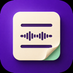

# Notesy



**Your Obsidian vault, on your wrist. Free and MIT open source.**

[Install](docs/INSTALL.md) · [User guide](docs/USER_GUIDE.md) · [Troubleshooting](docs/TROUBLESHOOTING.md) · [Privacy](PRIVACY.md) · [Release preparation](RELEASING.md)

Notesy 1.0.0 is prepared for its first public release alongside
[Organik Apps Pebble Connector](https://github.com/GeezusChrotch/organik-pebble-connector).
[Install from the Pebble store](https://apps.repebble.com/a9d4515681c34b5088993dc6) or
[download the 1.0.0 public beta](https://github.com/GeezusChrotch/notesy/releases/tag/v1.0.0).
See [release status](docs/RELEASE_STATUS.md) for validation details.

Browse an Obsidian vault, read notes and capture dictation on Pebble Time and Time 2. Version 1.0.0 · initial public beta.
Choose the vault in **Organik Apps Pebble Connector**. No Obsidian plugin or dedicated notes folder
is required. Ordinary Markdown notes created in Obsidian appear alongside watch-created notes.
No personal vault, account, network address or credential is embedded in the shared app.

## Watch controls

| Gesture | Main / folder view | Open note |
| --- | --- | --- |
| Up / Down press | Move through entries | Scroll text |
| Select press | Open folder or note; select New note for Quick Dictate / Stitch | Actions menu |
| Up long press | Pin / unpin selected item | Pin / unpin note |
| Select long press | Actions menu | Quick Dictate (append) |
| Down long press | Quick Dictate (new note) | No action |
| Back press | Previous location; exit at root | Return to browser |
| Back double press | Actions menu | Actions menu |
| Back long press | Exit app (watch OS) | Exit app (watch OS) |

Phone Settings → Button shortcuts lets users assign **all six press/long-press gestures separately
for each view**: normal navigation, Quick Dictate or Stitch for a new note or append, delete, pin/unpin, actions, no action, refresh or dictate to search.
Double-pressing Back always opens Actions, including movement controls if normal buttons were reassigned.
There are no Back or Next/Previous page menu entries.

The main page shows pins first, then folders, then root notes, alphabetically within each group.
Nested folders open with Select. Lists keep 15 entries on the watch; moving beyond either edge
loads the adjacent batch automatically. Folder listings are stable while paging, even if files
change in Obsidian. Use Refresh in Actions to see changes; listings expire after 30 minutes.
Notes scroll normally and fetch more text at the edge of the loaded chunk.

**Why two dictation options?** Pebble limits each recording to 15 seconds, and Notesy cannot
extend that system limit. **Quick Dictate** is for one short thought. **Stitch** is for longer
notes: it joins multiple recordings of up to 15 seconds into the same note. Both work for new
notes and appending. Stitch saves each accepted section before
listening again; Back finishes, keeping earlier sections. Both modes also work for Append, and
connection failures stop recording while retaining the pending section. See the
[dictation guide](docs/USER_GUIDE.md#quick-dictate-and-stitch).

New notes save in the folder being viewed. When assigned in note view, it saves alongside the
open note. **Append** targets the selected or open note. **Delete note** immediately moves that
note into `.trash` inside its containing folder, without a second confirmation. Folders cannot
be deleted from the watch. Finder’s Command-Shift-Period reveals `.trash` for recovery.

Pins are stored by the Mac connector per vault and survive restarts. A pinned root item appears
only once. Nested pins open directly from the main page. A renamed or moved item needs to be
pinned again at its new location; missing pins are hidden.

## Dictate to search

Open Actions → Dictate to search, speak a short term, then select a result to read it.
Search works across the vault, including folders you have not opened. Titles and folder names
use accent-insensitive fuzzy matching; matching words in note text rank below title matches.
Results show the containing folder and load more automatically as you scroll. Back returns to
the previous browser location. Search again repeats dictation without saving a note. You can
assign search to any short or long press in either view using phone Settings.

Search returns up to 100 ranked matches. Scans stop after 60,000 entries or roughly 7.5 seconds;
limited scans are labeled Partial matches. Body search skips files above 1 MB. Search results
remain stable for 30 minutes; Search again or Refresh performs a new scan. The Mac must be awake.

## Hidden folders, tasks and pictures

Phone Settings → Hidden folders → Load folders shows a folder tree. Select any folders to hide,
expand subfolders as needed, then Apply hidden folders. Hidden choices apply to browsing, pins
and search, including descendants; reopen Notesy or refresh its list afterward. Files are not
moved. Pictures in hidden attachment folders can still appear in visible notes.

Notes with Markdown tasks or embedded pictures open as a content menu. Long paragraphs scroll
within their row before Up/Down moves to the next item; photo rows keep their position as images
load. Select a checkbox to
check or uncheck it in Obsidian; only the marker changes. Normal text, line endings and metadata
are preserved. If Obsidian edited the note since it loaded, reopen before changing a task.
Custom note-button assignments still apply; keep Select as Normal navigation to toggle tasks.
Task changes require the Mac connection and show saved only after acknowledgement.

Images load inline when their menu row is selected; Select retries a failed image. Local PNG,
JPEG, GIF (first frame), WebP, HEIC, TIFF, BMP and SVG files are converted by macOS into Pebble's
64-color palette, up to 120 × 100 on Time or 176 × 150 on Time 2. Pictures are scaled to fit,
so small text in large images may be difficult to read. Wikilinks, Markdown image links and
short unique attachment names work. Remote web images and non-image embeds are not downloaded.

Native `.excalidraw` files and Obsidian drawings (including ordinary `.md` filenames marked
with `excalidraw-plugin` in frontmatter and compressed JSON)
render locally using Excalidraw's export library. Drawings and their embedded raster images stay
on your Mac. Source drawings are never rewritten; use New note alongside a drawing for dictation.

## Setup and upgrades

Choose your vault in the Mac connector, start Notesy, start its private connection, and select
Connect phone. Scan the one-time QR code. On the phone, copy the pairing details into
Pebble → Notesy → Settings, test, and save. Install `dist/Notesy-1.0.0.pbw` on the watch.
The connector requires macOS 14+ and bundles its runtime. Keep Tailscale connected on both devices.

For an existing Notesy installation, update both the connector and watch app, then reopen
Notesy. The phone learns vault browsing support using its existing pairing. Old queued
captures retain their original dedicated folder through the legacy API; existing files are not
moved. New captures record their folder and vault when dictated, so navigating elsewhere cannot
redirect pending text. A watch draft remains until the phone stores it; the phone retains up to
20 pending captures across restarts. Only a confirmed Mac receipt produces **Saved to vault**.
Phone Settings exposes pending text for recovery after an intentional destination change.

## Appearance and filenames

Appearance uses Pome’s five presets and custom background, text and selection colors. Time 2
includes Inter, Roboto, Open Sans, Montserrat and Poppins at 14, 18, 22, 26 and 30 pixels.
Pebble Time uses Pome’s system-font options and supported sizes. The chosen font applies to
browser entries, actions and reading; hints remain small. Selected long menu titles scroll after a
brief pause, including search results and Actions. Phone Settings → Appearance → Long menu titles
offers Off, Slow, Normal (default), Fast and Very fast; unselected and short titles stay still. See `resources/fonts/licenses`.

New files use the Mac’s local date, readable time and first sentence:
`2026-09-09 - 5.32pm - This is the dictated note.md`. The watch displays `5:32pm`.
Collisions get `(2)`, `(3)`, etc. Existing filenames are preserved. Delivery IDs stay in metadata
and receipts; invisible append markers prevent duplicate retries.

## Limits

- Dictation needs a microphone-equipped Pebble and the paired phone’s working transcription
  service. Captures are limited to 767 UTF-8 bytes; longer text is rejected, never truncated.
- The Mac must be awake for reading and delivery. Pending captures retry while the phone runs
  Notesy, including when reopened; this is not continuous iPhone background execution.
- Regular Markdown notes and drawing source files up to 1 MB are supported. Image attachments
  have a 20 MB file / 32 megapixel decode limit. Drawings allow up to 10,000 elements; very complex
  scenes may time out. Plugin-generated views and custom task status symbols are not interactive.
  Font glyph coverage varies.
- Hidden paths and symbolic links are excluded. Browsing does not recursively scan the vault:
  visited folders and search results are indexed. A folder can contain up to 60,000 visible entries; navigation
  history supports 24 opened folders. Both directions of paging use bounded watch memory.
- A missing append target leaves the captured text queued for recovery; it never creates a
  replacement note. Pins refer to file paths, not Obsidian rename tracking.

## Development

```sh
npm ci --prefix renderer
node renderer/build.mjs
swiftc -gnone -framework AppKit -framework WebKit renderer/ImageHelper.swift -o renderer/dist/notesy-image-helper
npm test
npm run check
npm run package
```

Native C handles the watch UI, buttons and draft persistence. PebbleKit JS handles settings,
transport and durable delivery. `gateway/server.js` hosts the loopback API;
`gateway/browser.js` implements vault navigation, pins and explicit destinations while the v1
API remains compatible with old queued notes. The Mac build bundles the server modules, isolated image helper, Excalidraw renderer and fonts.
Renderer versions and dependency overrides are pinned in renderer/package-lock.json. The renderer
blocks HTTP(S) requests and only receives the selected local image or drawing.

Use `build/StoneNotes.pbw` for debugging and `dist/Notesy-1.0.0.pbw` for distribution; the latter
omits SDK source maps. `tests/watch-emulator.py` exercises the compiled C app against the disposable
vault in `tests/emulator-fixture.js`; it requires a fixture PBW with inert phone JS, never a physical
watch. Phone transport and settings have separate automated tests. See `PRIVACY.md` for data handling.

To run the emulator checks with the Python environment that contains `pebble_tool`:

```sh
python3 scripts/emulator-fixture.py
pebble install --emulator emery build/Notesy-fixture.pbw
python tests/watch-emulator.py
WATCH_TEST_DICTATION_ONLY=1 python tests/watch-emulator.py
WATCH_TEST_STITCH_ONLY=1 python tests/watch-emulator.py
WATCH_TEST_STITCH_STOP_ONLY=1 python tests/watch-emulator.py
WATCH_TEST_SEARCH_ONLY=1 python tests/watch-emulator.py
WATCH_TEST_RICH_ONLY=1 python tests/watch-emulator.py
```

Use only the emulator fixture for those commands. The dictation check supplies simulated
transcripts through the SDK voice protocol; it does not verify a real microphone or phone speech
service. Normal watch installations must use `dist/Notesy-1.0.0.pbw`.

Notesy was previously named StoneNotes. Its watch UUID, saved settings, queues, pins and pairing remain compatible. Internal storage keys and the wire service ID keep their original names; existing notes are not renamed or rewritten.

## Beta testing status

The release passes 49 automated tests and Basalt/Emery builds. Compiled emulator checks cover
Stitch, ordinary capture, scrolling, tasks and previews. Final physical-watch Stitch and fresh
Mac/phone setup checks remain pending; see [release status](docs/RELEASE_STATUS.md).

## Thank you

Thank you to ChatGPT and Codex, especially ChatGPT 5.6 Sol and ChatGPT 6 Astra, and to the people at OpenAI who build these tools, for allowing a nerd with an idea to make cool stuff.

We also thank the developers and communities behind the apps, libraries, fonts and tools we build
on. [Full acknowledgments](ACKNOWLEDGMENTS.md).
